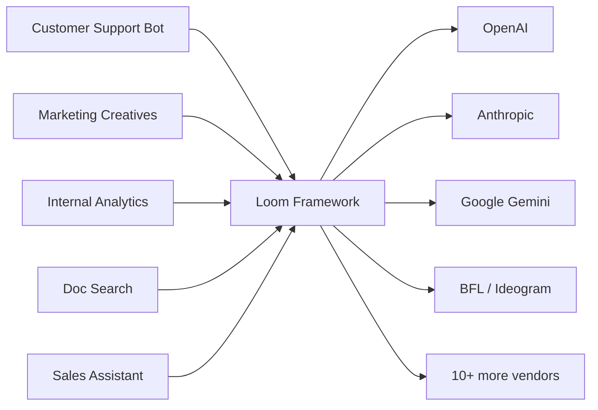
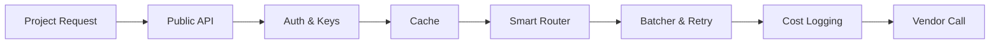
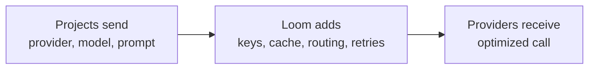
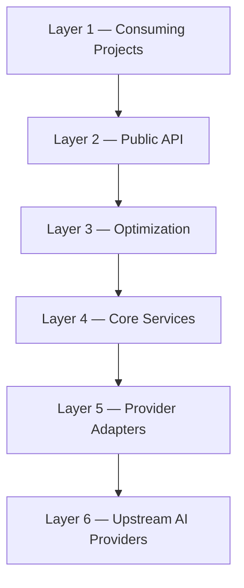

# Loom — Systems Diagram

> Open VS Code preview: `Ctrl+Shift+V` (Win/Linux) or `Cmd+Shift+V` (Mac). Zoom: `Ctrl++` / `Ctrl+-`.

---

## Middleware position

---

## What Loom does internally

---

## What flows through each boundary

---

## Layered view

---

## Why the middle position matters

| Benefit | What it means |
|---|---|
| **One integration** | Projects learn one API instead of fourteen |
| **Central optimization** | Caching, batching, routing — built once, savings everywhere |
| **Vendor changes absorbed** | Update Loom once instead of N project repos |
| **Unified observability** | Real cost visibility per project, per model |
| **Key safety** | API keys live in one place, not scattered across repos |
| **Faster onboarding** | New AI projects ship in hours, not days |